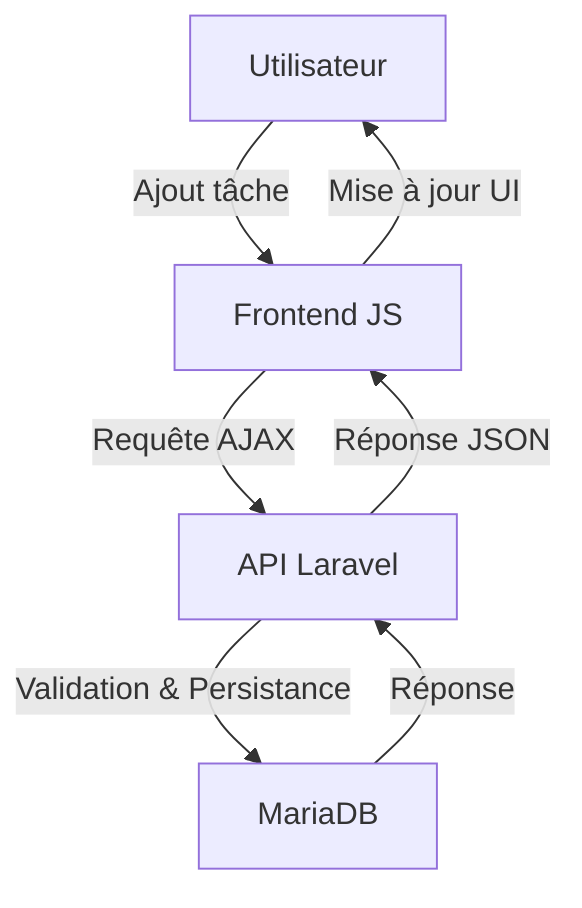

# Documentation Technique – Task Manager

## Vue d'ensemble de l'architecture

- **Architecture fullstack** :
  - Frontend statique en HTML/CSS/JavaScript Vanilla
  - Backend API RESTful en Laravel (PHP)
  - Base de données MariaDB
- **Organisation du projet** :
  - `frontend/` : ressources statiques (HTML, CSS, JS)
  - `backend/` : application Laravel
  - `docs/` : documentation, scripts SQL, tests API

## Composants principaux

### Frontend

- **index.html** :
  - Page unique affichant la liste des tâches et le formulaire d'ajout/édition
  - Modes d'affichage :
    - Liste des tâches
    - Formulaire de création/édition
    - Messages de succès/erreur
- **js/app.js** :
  - Point d'entrée JS, gestion des interactions utilisateur
- **js/taskCreate.js** :
  - Affichage/masquage du formulaire de création
  - Soumission du formulaire via AJAX
  - Appel à l'API pour créer une tâche
- **js/taskList.js, taskUpdate.js, taskDelete.js** :
  - Gestion du listing, modification et suppression des tâches
- **css/style.css** :
  - Styles minimalistes, accessibilité et bonnes pratiques

### Backend (Laravel)

- **app/Models/Task.php** :
  - Modèle Eloquent représentant une tâche
- **app/Http/Controllers/** :
  - Contrôleurs pour la gestion des tâches, catégories, tags
- **routes/api.php** :
  - Définition des endpoints API (CRUD tâches, catégories, tags)
- **config/database.php** :
  - Configuration de la connexion MariaDB
- **database/migrations/** :
  - Migrations pour la structure des tables
- **database/seeders/** :
  - Données de test

## Fonctionnement et flux principal



## Configuration et mise en place

- **Installation du backend** :
  - `composer create-project laravel/laravel backend`
- **Base de données** :
  - Créer la BDD `todolist` (MariaDB)
  - Exécuter le script SQL `docs/db.dump.sql`
- **Configuration Laravel** :
  - Renseigner `.env` :
    - `DB_DATABASE=todolist`
    - `DB_USERNAME=todolist`
    - `DB_PASSWORD=todolist`
  - Générer la clé : `php artisan key:generate`
- **Lancement du serveur** :
  - `php artisan serve` (backend)
  - Ouvrir `frontend/index.html` dans le navigateur

## Design patterns et choix techniques

- **RESTful API** : endpoints clairs pour chaque ressource
- **Eloquent ORM** : gestion des modèles et relations
- **Vanilla JS** : simplicité, performance, accessibilité
- **Séparation des responsabilités** :
  - Backend : logique métier, persistance
  - Frontend : affichage, interactions utilisateur

## Extensibilité et personnalisation

- **Ajout de nouvelles entités** :
  - Créer un modèle, migration, contrôleur, routes
- **Personnalisation du frontend** :
  - Modifier les fichiers JS/CSS pour adapter l'UI
- **Sécurisation** :
  - Ajouter l'authentification Laravel (Sanctum, Passport)

## Exemples d'utilisation

### Création d'une tâche (AJAX)

```js
fetch('/api/tasks', {
  method: 'POST',
  headers: { 'Content-Type': 'application/json' },
  body: JSON.stringify({ title: 'Nouvelle tâche', ... })
})
.then(res => res.json())
.then(data => { /* mise à jour UI */ })
```

### Endpoint Laravel

```php
// routes/api.php
Route::post('/tasks', [TaskController::class, 'store']);
```

## Pour aller plus loin

- [Documentation Laravel](https://laravel.com/docs/8.x)
- [Modern CSS Reset](https://www.joshwcomeau.com/css/custom-css-reset/)
- [Accessibilité Web](https://www.w3.org/WAI/)
